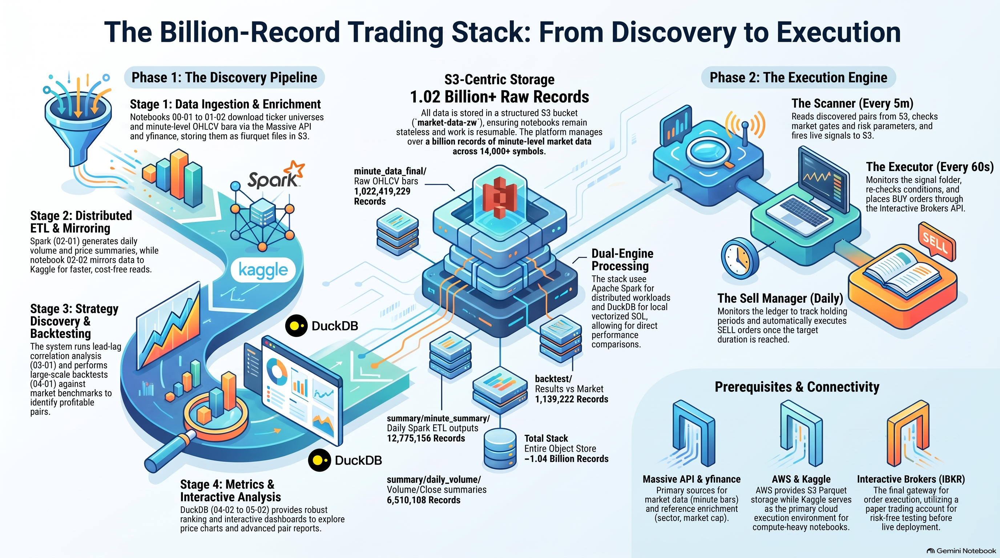
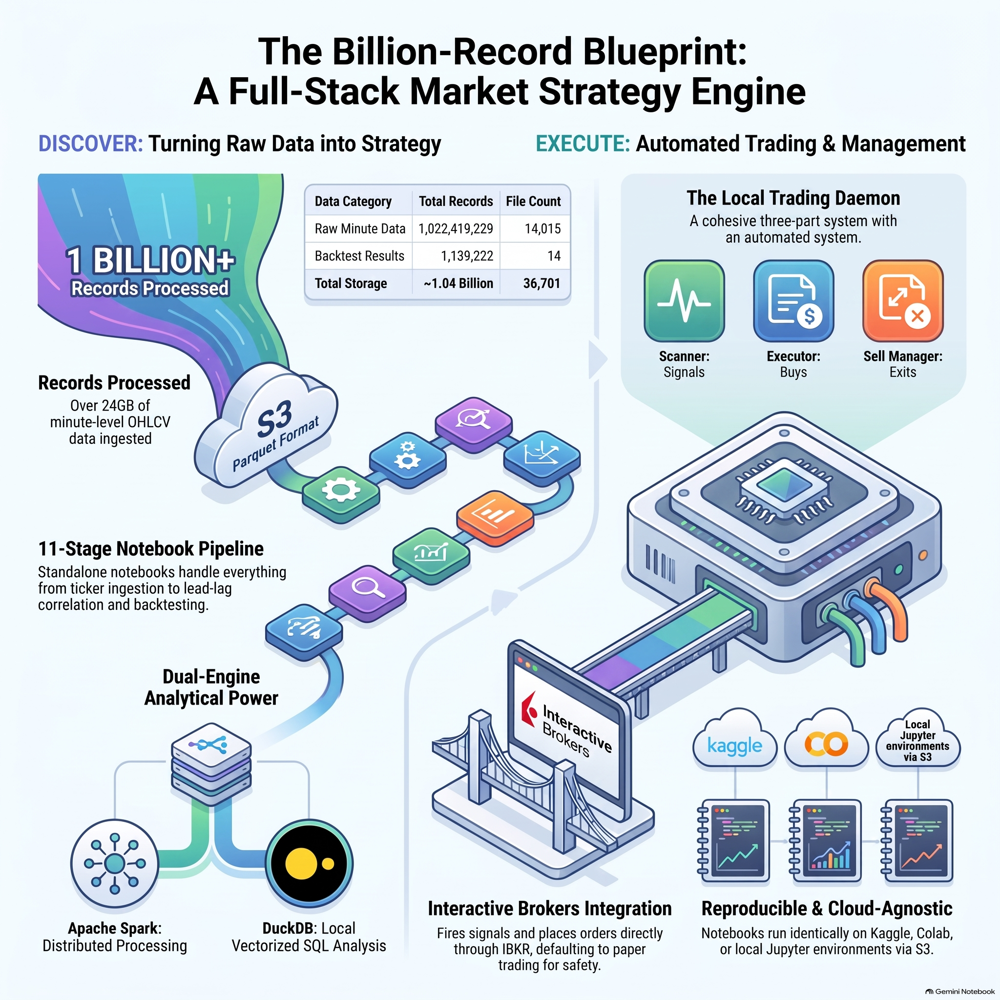
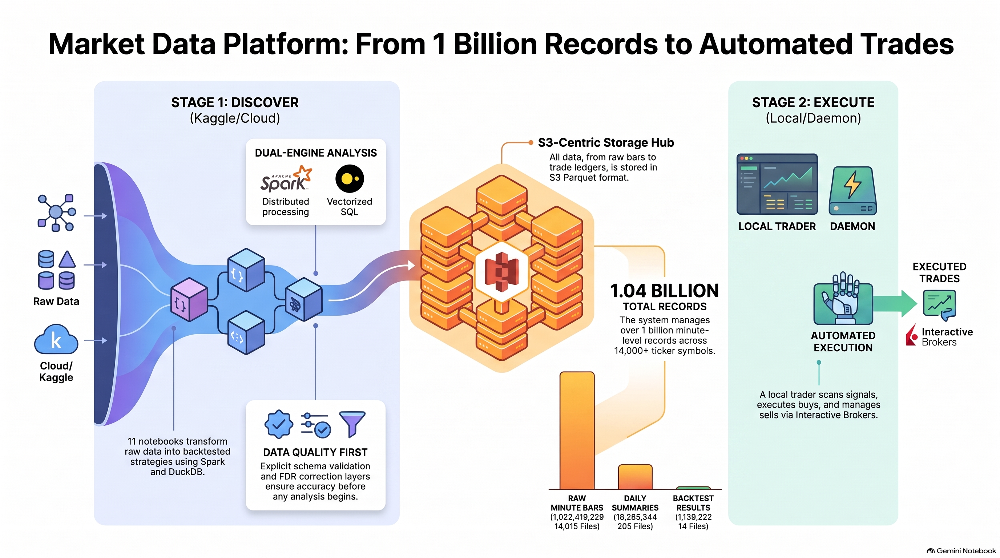
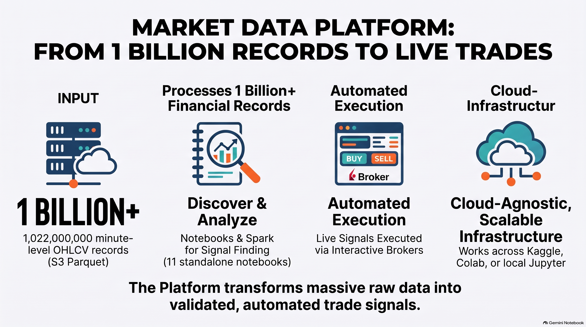

# Market Data Platform

A **full trading stack** that discovers market strategies and executes them
end to end:

1. **Discover** — a pipeline of 11 self-contained notebooks that transform
   **billions of financial market-data records** into analytics-ready
   datasets: ticker ingestion, minute-bar download, daily summary ETL,
   lead-lag correlation analysis, backtesting, and interactive pair
   exploration (Apache Spark, DuckDB, Parquet, S3-compatible storage).
2. **Execute** — a local trading daemon (scanner → executor → sell manager)
   that reads the discovered pairs from S3, monitors live prices, fires
   signals, and places orders through **Interactive Brokers** — on the
   **paper trading account** for testing, or live.

Every notebook is standalone: it installs its own dependencies, reads its
inputs from S3, and writes its outputs back to S3. The same notebook runs on
**Kaggle**, local Jupyter, or Colab. See
[docs/services.md](docs/services.md) for detailed documentation of every
external service (Massive, S3, Kaggle, yfinance, Interactive Brokers, the
trader) and how they fit together.

> **Goal:** Build a reproducible, scalable market-data platform that ingests
> raw stock-minute data from object storage, validates and transforms it into
> analytical datasets, and supports efficient querying through distributed
> and local analytical engines.

---

## Project Overview — Video, Slides & Audio

A short multimedia overview of the stack. Images and the PDF render inline on
GitHub; the video, audio, and PowerPoint open via their links.

**Architecture diagrams**

| | |
|---|---|
|  |  |
|  |  |

**Video** — how the trading bots actually execute orders:

- 🎬 [How Trading Bots Actually Execute Orders](media/How_Trading_Bots_Actually_Execute_Orders.mp4) *(MP4, ~6 MB — GitHub plays it in the file viewer)*

**Audio** — narrated walkthrough:

- 🎧 [Autonomous Trading with a Billion Rows](media/Autonomous_trading_with_a_billion_rows.m4a) *(M4A, ~43 MB)*

**Slides & document**:

- 📕 [Quant Trading Blueprint — PDF](media/Quant_Trading_Blueprint.pdf) *(14 pages, GitHub previews PDFs inline)*
- 📊 [Quant Trading Blueprint — PowerPoint](media/Quant_Trading_Blueprint.pptx) *(open in PowerPoint, Google Slides, or LibreOffice)*

> The `media/` folder is committed alongside the repo, so these files are
> always served from the repository itself. On a slow connection, the images
> are the largest inline payload (4–5 MB each).

---

## The Full Stack at a Glance

```text
┌──────────────────────────── DISCOVER (Kaggle notebooks) ───────────────────────────┐
│ 00-01/00-02 tickers  →  01-01/01-02 minute bars  →  02-01 daily summary            │
│   →  02-02 Kaggle mirror  →  03-01 correlation pairs  →  04-01 backtest            │
│   →  04-02 metrics  →  05-01/05-02 explore pairs                 │                 │
└──────────────────────────────────────────────────────────────┬────────────────────┘
                                                               │ S3: backtest/ + signals
┌────────────────────────────── EXECUTE (local trader) ────────▼────────────────────┐
│ Scanner (every 5m): pairs → market gate → risk → live signal → S3 signals/        │
│ Executor (every 60s): signals → re-check → BUY via IB → S3 trade_log (ledger)     │
│ Sell Manager (daily): ledger → days held ≥ holding_days → SELL via IB             │
└──────────────────────────────┬────────────────────────────────────────────────────┘
                               ▼
                  Interactive Brokers (paper first)
```

---

## The Pipeline

Run the notebooks in order — each one consumes the previous stage's S3
output:

```text
 00-01 ticker load ──► 00-02 ticker universe
        │                      │
        ▼                      ▼
 01-01 historical bars ──► 01-02 merge minute data
        │
        ▼
 02-01 ETL summary (Spark)
        │
        ▼
 02-02 S3 -> Kaggle dataset (optional: fast/free mirror for consumers)
        │
        ▼
 03-01 correlation (Spark)
        │
        ▼
 04-01 backtest (Spark) ──► 04-02 analyze backtest (DuckDB)
        │
        ▼
 05-01 pair explorer / 05-02 advanced pair analysis (interactive)
```

| # | Notebook | What it does | Service | Output |
|---|---|---|---|---|
| 00-01 | `ticker-load` | Ticker types + active stock universe | Massive API | S3 `types/`, `summary/tickers/` |
| 00-02 | `ticker-universe` | Per-ticker reference details | yfinance | S3 `summary/ticker_yahoo_details/` |
| 01-01 | `historical-load` | Minute OHLCV bars per ticker | Massive API | S3 `minute_data_staging/` |
| 01-02 | `merge-minute-data` | Merge staging into final, dedup | S3 | S3 `minute_data_final/` |
| 02-01 | `etl-summary` | Daily volume + first/last bar summaries | Spark | S3 `summary/` |
| 02-02 | `s3-to-kaggle-dataset` | Mirror summaries/strategies to a private Kaggle dataset (faster + no S3 read costs) | Kaggle | Kaggle dataset `dsptlp/market-data-s3-dataset` |
| 03-01 | `correlation` | Lead-lag pair analysis + FDR | Spark | S3 `strategies/correlation/` |
| 04-01 | `backtest` | Backtest every pair vs market | Spark | S3 `backtest/` |
| 04-02 | `analyze-backtest` | Pair metrics + robust ranking | DuckDB | S3 `analysis/backtest_metrics/` |
| 05-01 | `pair-explorer` | Interactive price charts per pair | DuckDB | — |
| 05-02 | `advanced-pair-analysis` | Interactive dashboard + reports | DuckDB | reports/ |

Consumers (03-01, 04-01, 04-02, 05-01, 05-02) automatically prefer the
Kaggle dataset mirror when it is attached to the kernel, falling back to S3
otherwise.

---

## External Services

The pipeline is built on four external services. Each is documented in
detail in [docs/services.md](docs/services.md).

| Service | Role | Docs |
|---|---|---|
| **Massive API** | Market data: ticker universe + minute bars (`RESTClient`, cursor pagination, rate limits) | [services.md](docs/services.md#1-massive-api-market-data-provider) |
| **AWS S3** | All Parquet storage (`market-data-zw`, boto3 + DuckDB httpfs + Spark s3a) | [services.md](docs/services.md#2-aws-s3-object-storage) |
| **Kaggle** | Cloud execution of the notebooks (12h sessions, secrets, `kaggle kernels push`) + private dataset mirror for fast/free reads (`02-02`) | [services.md](docs/services.md#3-kaggle-execution-platform) |
| **yfinance** | Reference enrichment (sector, market cap) | [services.md](docs/services.md#4-yfinance-reference-data-enrichment) |
| **Interactive Brokers + IBC** | Placing orders from the signals (local trading machine, paper API on port 4002, auto-restart on crash) | [services.md](docs/services.md#7-interactive-brokers-order-execution) |
| **AutoTrade Trader** | The local execution code (scanner / executor / sell manager) that reads the S3 backtest to decide what to buy and keeps the order ledger in S3 | [services.md](docs/services.md#8-autotrade-trader-the-execution-code) |

```text
┌───────────────┐     ┌───────────────┐     ┌───────────────┐
│  Massive API  │     │   yfinance    │     │     Kaggle    │
└───────┬───────┘     └───────┬───────┘     └───────┬───────┘
        ▼                     ▼                     │
┌───────────────────────────────────────┐           │
│            S3 (market-data-zw)        │◄──────────┘
└───────┬───────────────────────┬───────┘
        ▼                       ▼
   DuckDB httpfs            Spark s3a
```

---

## Prerequisites: Accounts & Keys

To run this pipeline you need **three accounts/keys** (plus a free one that
needs no account). Get them all before starting:

| # | Account / Key | Needed for | How to get it | Cost |
|---|---|---|---|---|
| 1 | **Kaggle account** | Executing the notebooks (cloud compute) | Sign up at [kaggle.com](https://www.kaggle.com) — free account | Free (weekly session quota) |
| 2 | **AWS account + S3 bucket + access keys** | All data storage (`market-data-zw` bucket) | Sign up at [aws.amazon.com](https://aws.amazon.com), create a bucket, and generate **Access Keys** in IAM | ~a few $/month for ~24 GB storage |
| 3 | **Massive API key** | Market data: ticker universe + minute bars | Sign up for the Massive API and copy your API key | Free tier ~5 calls/min; paid tiers for higher limits |
| 4 | **yfinance** | Reference details (sector, market cap) | Nothing — open-source library, no account | Free |
| 5 | **Interactive Brokers account + Gateway** *(only for placing orders)* | Executing the signals on paper/live | Sign up at [interactivebrokers.com](https://www.interactivebrokers.com), **enable the Paper Trading account** in Client Portal (Settings → Account Settings → Trading Configuration), and install IB Gateway 10.50 + **IBC** (the "ibx tool", auto-restart on crash) — exact steps in [services.md §7](docs/services.md#setting-up-an-interactive-brokers-account-from-scratch) | Paper: free (virtual $1M). Live: commission-based |

Plus, if you push from the command line: **Kaggle CLI credentials**
(`kaggle configure` or `KAGGLE_USERNAME` / `KAGGLE_API_TOKEN`).

Credentials are provided to the notebooks as **environment variables**
(`AWS_ACCESS_KEY_ID`, `AWS_SECRET_ACCESS_KEY`, `AWS_REGION`, `S3_BUCKET`,
`MASSIVE_API_KEY`) or via a `config.json` — never hard-coded. Which notebooks
need which key:

| Key | Needed by |
|---|---|
| AWS access/secret keys | every notebook |
| `MASSIVE_API_KEY` | `00-01-ticker-load`, `01-01-historical-load` |
| Kaggle CLI creds | `push_kernels.py` / `batch_runner.py` (local machine only) |

See [docs/services.md](docs/services.md) for full details on each service,
its API, limits, and costs.

---

## Quick Start

### Option A: Run on Kaggle (recommended)

> Full walkthrough: **[docs/services.md → "Running the entire pipeline end-to-end"](docs/services.md#running-the-entire-pipeline-end-to-end)**

1. Create secrets in each notebook (Add-ons → Secrets):
   `AWS_ACCESS_KEY_ID`, `AWS_SECRET_ACCESS_KEY`, `MASSIVE_API_KEY`.
2. Push the notebooks:

   ```bash
   pip install kaggle
   python3 push_kernels.py --dry-run             # show the plan
   python3 push_kernels.py --push                # push all 11
   python3 push_kernels.py --push 03-01-correlation.ipynb   # push one
   ```

3. Run the notebooks in order (`00-01 → 00-02 → 01-01 → 01-02 → 02-01 →
   [02-02 → attach the mirror dataset] → 03-01 → 04-01 → 04-02 → 05-*`).
   The slow stages (00-02, 01-01) are incremental and resume automatically
   on re-run; the correlation stage is designed for parallel instances:

   ```bash
   python3 batch_runner.py --once --count 4 --kernels 03-01
   ```

   To keep N instances of one notebook running in a loop — e.g. 3 parallel
   `03-01` runs refilling as each finishes, to search for a specific
   correlation pattern — see the
   [strategy-search section in docs/services.md](docs/services.md#strategy-search-keep-n-instances-running-in-a-loop).

   **Speed up & cut S3 costs:** after `02-01` (and after each new batch of
   03-01/04-01/04-02 output), run `02-02-s3-to-kaggle-dataset` to mirror the
   data into your private Kaggle dataset, and attach
   `dsptlp/market-data-s3-dataset` to the consumer kernels — they then read
   from local disk instead of S3.

### Option B: Run locally

```bash
pip install jupyter numpy pandas pyarrow boto3 duckdb scipy tqdm \
            matplotlib plotly ipywidgets yfinance massive

# Spark stages (02-01, 03-01, 04-01) additionally need:
pip install pyspark      # + a Java runtime (Java 17)

jupyter lab
```

Set the environment variables, then run the notebooks in order:

```bash
export AWS_ACCESS_KEY_ID=...
export AWS_SECRET_ACCESS_KEY=...
export AWS_REGION=us-east-1
export S3_BUCKET=market-data-zw
export MASSIVE_API_KEY=...
```

(Or drop a `config.json` next to the notebooks — see `config.example.json`.)

---

## S3 Data Structure

All market data lives in the AWS S3 bucket **`market-data-zw`** under the
`parquet_data/` prefix (region `us-east-1`):

```text
s3://market-data-zw/parquet_data/
│
├── minute_data_final/                     # Raw minute-level OHLCV, one Parquet per symbol (~14k symbols)
│   └── <SYMBOL>.parquet
│
├── summary/
│   ├── minute_summary/data.parquet/       # First + last minute bar per symbol/day (Spark output)
│   ├── daily_volume/data.parquet/         # Daily volume/close summary (Spark output)
│   ├── tickers/tickers.parquet            # Ticker universe (name, market, type, exchange, ...)
│   └── ticker_yahoo_details/              # Per-ticker reference details (~13k files)
│
├── types/
│   └── ticker_types.parquet               # Ticker type taxonomy (asset_class, code, description)
│
├── backtest/<YYYYMMDD_HHMM>/data.parquet  # Backtest run results (per-run folder)
│
├── analysis/
│   └── backtest_metrics/<YYYYMMDD_HHMM>/data.parquet   # Backtest metrics per run
│
├── strategies/
│   └── correlation/<YYYYMMDD_HHMM>/data.parquet        # Correlation strategy outputs
│
└── logs/
    ├── trade_log/<YYYYMMDD>/<YYYYMMDD_HHMM>/           # Daily trade logs
    └── trader_debug_logs/                              # executor / scanner / sell_manager
```

### Raw Minute Data (`minute_data_final/`)

| Column | Type | Description |
|---|---|---|
| `symbol` | string | Ticker symbol |
| `date` | int64 | Timestamp as epoch **ms** |
| `open` / `high` / `low` / `close` | double | OHLC prices |
| `volume` | double | Trade volume |
| `vwap` | double | Volume-weighted average price |
| `trades` | int64 | Number of trades |

### Data Volume

The bucket currently holds **36,701 objects totaling ~24 GB**, with the raw
minute data alone containing **over 1 billion records** (measured from actual
Parquet metadata — not estimates or fabricated numbers).

| Folder | Files | Records |
|---|---:|---:|
| `minute_data_final/` | 14,015 | **1,022,419,229** |
| `summary/minute_summary/` | 200 | 12,775,156 |
| `summary/daily_volume/` | 5 | 6,510,188 |
| `summary/tickers/` | 1 | 13,151 |
| `summary/ticker_yahoo_details/` | 13,152 | 27,125 |
| `types/` | 1 | 25 |
| `backtest/` | 14 | 1,139,222 |
| `analysis/backtest_metrics/` | 1 | 5,408 |
| `strategies/` | 682 | 9,447 |
| `signals/` | 166 | 17,996 |
| **Total** | **~36.7k objects** | **~1.04 billion** |

---

## Processing Engines

The same analytical workload is implemented with two engines so the
trade-offs are measurable:

- **Apache Spark** (02-01, 03-01, 04-01): distributed processing — partition
  pruning, predicate pushdown, shuffles, parallel aggregation — reading S3
  via `s3a://`.
- **DuckDB** (04-02, 05-01, 05-02): local vectorized processing — SQL over
  Parquet via `httpfs`, useful for exploring how far a single-node engine
  scales before distributed processing wins.

---

## Data Quality

A key design principle:

> **Fast pipelines are useless if they produce incorrect data.**

The data-quality layer (schema checks, quality filters, market-adjustment,
FDR correction) runs as explicit cells inside each notebook before any
analysis:

```text
                 Raw Data
                    │
                    ▼
             Schema / Record Validation
                    │
                    ▼
         Data Quality Filters
                    │
          ┌─────────┴─────────┐
          │                   │
       Valid                 Invalid
          │                   │
          ▼                   ▼
    Transformation        (dropped / reported)
          │
          ▼
      Aggregation
```

---

## Repository Structure

```text
market-data-platform/
│
├── README.md
├── LICENSE
├── config.example.json        # non-secret config template
│
├── notebooks/                 # the pipeline (run in order)
│   ├── 00-01-ticker-load.ipynb
│   ├── 00-02-ticker-universe.ipynb
│   ├── 01-01-historical-load.ipynb
│   ├── 01-02-merge-minute-data.ipynb
│   ├── 02-01-etl-summary.ipynb
│   ├── 02-02-s3-to-kaggle-dataset.ipynb
│   ├── 03-01-correlation.ipynb
│   ├── 04-01-backtest.ipynb
│   ├── 04-02-analyze-backtest.ipynb
│   ├── 05-01-pair-explorer.ipynb
│   └── 05-02-advanced-pair-analysis.ipynb
│
├── push_kernels.py            # push notebooks to Kaggle (`kaggle kernels push`)
├── batch_runner.py            # continuous / parallel Kaggle runs
│
├── docs/
│   ├── services.md            # EXTERNAL SERVICES (Massive, S3, Kaggle, ...)
│   ├── architecture.md
│   ├── partitioning.md
│   └── performance.md
│
└── benchmarks/
    └── results.md             # measured benchmark numbers (never fabricated)
```

---

## Engineering Principles

- **Reproducibility** — a pipeline should produce the same result when
  executed against the same input; deterministic filters are separated from
  randomized sampling.
- **Configuration over hard-coding** — credentials come from environment
  variables / `config.json`, never literals.
- **Measure before optimizing** — performance decisions are supported by
  measured benchmark results.
- **Minimize data movement** — already-processed work is detected from S3
  object keys; large-scale stages avoid unnecessary scans and shuffles.
- **Two engines, one workload** — Spark and DuckDB implement the same
  aggregation so local vs. distributed performance is directly comparable.

---

## Roadmap

### Phase 1: Foundation

- [x] Notebook pipeline (11 stages, self-contained)
- [x] Configuration system (env / config.json, no hard-coded secrets)
- [x] S3 storage + incremental ingestion (resume via object keys)
- [x] Data validation / quality filters

### Phase 2: Processing

- [x] Daily summary ETL (Spark)
- [x] Lead-lag correlation analysis + FDR correction
- [x] Backtest engine + market benchmark
- [x] Backtest metrics analysis (robust ranking, Fisher z-CI)
- [x] Interactive pair analysis (05-01 / 05-02)
- [ ] Predicate pushdown / partitioning benchmarks

### Phase 3: Scale

- [ ] 10M-row benchmark
- [ ] 100M-row benchmark
- [ ] 1B-row benchmark
- [ ] 10B+ row benchmark
- [ ] Spark cluster testing
- [ ] Performance profiling

### Phase 4: Production Engineering

- [x] Kaggle push + batch runner
- [x] Documentation (services, architecture, partitioning, performance)
- [ ] CI validation of notebooks
- [ ] Logging / metrics
- [ ] Error handling / alerting

---

## Documentation

- [External services (Massive, S3, Kaggle, yfinance)](docs/services.md)
- [Interactive Brokers order execution (IBC / ibx, auto-restart)](docs/services.md#7-interactive-brokers-order-execution)
- [Setting up an IBKR account + paper trading for testing](docs/services.md#setting-up-an-interactive-brokers-account-from-scratch)
- [AutoTrade Trader (scanner / executor / sell manager, S3 ledger)](docs/services.md#8-autotrade-trader-the-execution-code)
- [Architecture](docs/architecture.md)
- [Partitioning](docs/partitioning.md)
- [Performance](docs/performance.md)
- [Benchmark results](benchmarks/results.md)

---

## License

This project is licensed under the MIT License. See [LICENSE](LICENSE) for
details.